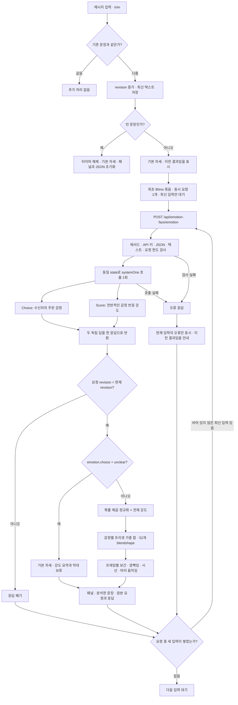

# 현재 감정 → 얼굴 변환 알고리즘

2026-09-28 현재 작업 폴더의 구현 기준. 이전 분석에서 제안한 **문장 반전 해석 개선은 아직 적용되지 않았다.**

[인터랙티브 다이어그램 열기](diagrams/emotion-face.html) · [편집 가능한 다이어그램 원본](diagrams/emotion-face.workflow.json)

HTML은 내려받아 브라우저에서 열 수 있는 독립 문서다. 확대, 검색, 테마 전환과 이미지 내보내기를 지원한다. 본문은 한국어이며 고정 뷰어 메뉴와 HTML 언어 속성은 도구의 기본값인 영어다.

## 전체 흐름



HTML의 `서버 입력 검증 → 오류 표시`는 검사 실패와 호출 실패를 합친 요약 경로다. HTTP 실패 외 네트워크·JSON 파싱·브라우저 시간 초과도 클라이언트 오류 경로로 들어간다. 모든 오류가 그대로 표시되는 것은 아니며 현재 revision과 텍스트가 일치해야 한다.

## Jev가 판단하는 부분

| 항목 | 현재 동작 |
| --- | --- |
| state | 작성 중일 수 있다는 상황 설명 + 현재 메시지 전문 |
| 없는 정보 | 실제 수신자와의 관계, 이전 대화, 의료 기록 등 |
| `emotion` | `neutral`, `happy`, `sad`, `angry`, `surprised`, `fear`, `disgust`, `contempt`, `unclear` 중 하나 |
| `intensity` | 감정 종류와 무관한 전반적인 반응 강도. 0~4 단계의 확률 가중 기대값 |
| 독립성 | 두 질문은 같은 state를 보지만 서로의 답을 전달받지 않는다 |
| `confidence` | 패널에 표시한다. 임계값으로 결과를 차단하거나 표정 세기에 곱하지 않는다 |
| 모델 | `TYPESAFE_MODEL`이 있으면 해당 버전, 없으면 `jev-latest` |

`neutral`은 이해 가능한 무감정 반응이다. `unclear`는 맥락 부족·불완전한 문장·해석 충돌 등으로 주된 반응을 정하기 어렵다는 별도 결과다. 확률 일부가 `unclear`에 배정됐다는 이유만으로 강도를 보류하지는 않는다. **최종 choice가 `unclear`여야 보류한다.**

## 코드가 표정으로 바꾸는 부분

```text
p[i]        = emotion.probabilities[i]
mix[i]      = p[i]² / Σ p[j]²
strength    = clamp(intensity.score / 4, 0, 1)^0.6
amount[i]   = mix[i] × strength
target[k]   = clamp(Σ amount[i] × preset[i][k], 0, 1)
```

합산은 감정 8종과 `unclear` 전체 확률을 포함한다. `neutral`과 `unclear`의 얼굴 프리셋은 비어 있으므로 나머지 표정의 비중을 낮춘다. 제곱합이 0이면 혼합 가중치는 모두 0이다. 최종 choice가 `unclear`이면 위 계산 대신 모든 혼합 가중치와 강도가 0인 `NEUTRAL`을 적용한다.

표정 프리셋은 직접 정한 ARKit 가중치다. Jev가 52개 얼굴 값을 생성하는 것이 아니다. 확률 혼합은 시각적 연출이며, 실제 사람이 여러 감정을 그 비율대로 동시에 느낀다는 의미가 아니다.

얼굴 가중치는 매 프레임 `1 − exp(−9 × dt)`의 비율로 목표값에 접근한다. 머리·시선도 별도 속도로 보간하며, 깜빡임과 미세 움직임을 더한 후 최종 가중치를 0~1로 제한한다. 기본 자세에서도 미세 움직임은 남는다.

### 앞서 확인한 완치 문장의 예

> I'm sorry... The vet said there's nothing more they can do. It's because you're fully recovered, so you have to be discharged.

앞선 진단의 실제 반복 호출 중 한 결과(`jev-1.13.0`)를 대입한 예다. 고정 출력이나 내부 추론 기록이 아니다.

| 단계 | 슬픔 | 기쁨 |
| --- | ---: | ---: |
| 원래 확률 | 0.65 | 0.14 |
| 제곱·정규화 | 0.9009 | 0.0418 |
| 강도 적용 (`score=2.97`, `strength≈0.8364`) | 0.7535 | 0.0349 |

마지막 행은 감정 프리셋 전체에 곱하는 가중치이며, 개별 blendshape 값은 아니다. **모델의 슬픔 선택 → 제곱으로 우세 감정 강화 → 높은 전반적 강도 적용**이 이어져 슬픈 얼굴이 강해진다. 현재 구현에는 뒤의 설명으로 앞의 의미가 바뀌는 문장을 별도 재검증하는 단계가 없다.

## 대기·실패·측정 규칙

| 구간 | 조건과 동작 |
| --- | --- |
| 동일 입력 | 양끝 공백을 제거한 문장이 같으면 재요청하지 않음 |
| 입력 변경 | 기본 자세로 전환. 마지막 분석 결과는 이전 결과 안내와 함께 보존 |
| 응답 대기 중 변경 | 모든 중간 입력을 요청하지 않고 마지막 입력 하나만 저장 |
| 오래된 결과 | 같은 문장을 비웠다가 다시 입력한 경우에도 revision이 달라 폐기 |
| 계속 입력 중 | 현재 문장과 일치하는 응답이 올 때까지 표정 갱신이 기다릴 수 있음 |
| 클라이언트 제한 | 요청당 15초. 시간 초과는 클라이언트 오류이며 서버 작업 취소를 보장하지 않음 |
| SDK 제한 | 시도당 5초, 재시도 최대 1회. 재시도 대기 시간은 별도 |
| 서버 인스턴스 한도 | 동시 4개, 분당 120개, UTC 날짜별 2,000개. 분산·영구·금액 한도 아님 |
| HTTP 오류 | 400 잘못된 입력, 405 메서드, 413 길이, 429 한도, 500 키 없음, 502 Jev 호출 실패 |
| 서버 시간 | SDK 호출 시작부터 응답까지, 재시도 포함 |
| 입력→결과 수신 | 해당 텍스트 변경부터 대기·HTTP·JSON 파싱까지. 렌더링 완료는 제외 |
| 강도 단계 표시 | 요약은 score 반올림, 확률 막대 강조는 확률이 가장 높은 단계 |

## 코드 근거

- [입력 대기열·revision 검사](../projects/emotion-face/reading-loop.ts)
- [HTTP 호출·unclear 분기·패널](../projects/emotion-face/main.ts)
- [질문·state·SDK 호출](../projects/emotion-face/server.ts)
- [HTTP 상태 처리](../server/api.ts), [인스턴스별 요청 한도](../server/budget.ts)
- [확률 변환·감정 프리셋](../projects/emotion-face/emotions.ts)
- [52개 가중치 합산·보간·미세 움직임](../projects/emotion-face/face.ts)

다이어그램은 모델 내부의 사고 과정이 아니라, 코드에서 관측 가능한 요청·판단·화면 적용 흐름을 나타낸다.
