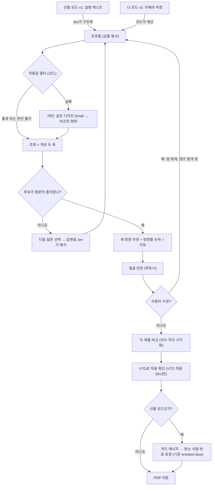

# 반응하는 아이웨어 에디터 기획

2026-09-30 기준 기획 초안. emotion-face를 브랜드 콘텐츠·PDP의 아이웨어 추천 경험으로 확장하는 안을 정리한다. 구현된 기능이 아니며, 아래 수치 중 **가설**로 표시한 값은 검증 전 초기값이다.

참고 자료:

- 노션 「2026-01-30 VTO(Virtual Try-On)」 조사 문서(백엔드파트). 이 문서에 인용한 시장·경쟁사 수치는 그 조사에서 가져왔으며 다시 검증하지 않았다.
- 자사 사이트 저장소 `gentle-renewal`의 VTO 구현 코드(`807ce8856` 기준). 자사 VTO의 현재 동작은 노션 문서가 아니라 이 코드를 근거로 적었다.

## 한 줄 요약

**현재 방향(2026-09-30 재정의):** 브랜드 콘텐츠 진입점은 **감정 투과율**, 구매 경로는 **선물 에디터**다. 둘 다 카메라를 쓰지 않는다. 카메라로 얼굴을 재는 나 모드는 VTO와 겹쳐 독립 제품에서 제외했다. 자세한 내용은 바로 아래 "재정의" 절에 있다. 이 요약의 나머지는 재정의 전의 통합안 설명이다.

**하나의 추천 엔진에 두 개의 입구를 둔다.** v1은 사진 없이 선물할 사람을 설명으로 입력하는 **선물 모드**, v2는 카메라로 본인 얼굴을 측정하는 **나 모드**다. 두 입구는 같은 형식의 프로필을 만들고, 이후 착용감 필터 → 조화 × 개성 두 축 → 세 방향 추천 → 얼굴 반응 → VTO·PDP로 이어지는 흐름을 공유한다.

VTO와의 관계에서 이 기획은 VTO가 약한 두 가지, 곧 **"무엇을 고를까"와 "맞는가"** 를 맡는다. 자사 VTO(Banuba)는 1차로 선글라스 5개 모델(컬러 단위 9개 SKU)만 지원한다. VTO 세션 안의 "다른 프레임" 목록은 추천이 아닌 고정 목록이며, 코드와 설계 문서에 **"유사 상품 추천이 가능해지면 되돌린다"** 고 적혀 있다. 이 기획의 추천이 들어갈 자리가 이미 비어 있는 셈이다. 선물 모드는 VTO 적용 범위와 생체정보 처리 절차 어느 쪽에도 의존하지 않아 카탈로그 전체를 대상으로 먼저 출시할 수 있다.

## 재정의: VTO와 겹치지 않는 목적 (2026-09-30)

자사 VTO가 실제로 운영되면서, 이 기획이 VTO와 겹치지 않는 목적을 가져야 했다. 기준은 한 문장이다.

> **VTO는 "내가 어떻게 보이는가"를 보여 준다. 이것은 "내가 어떻게 읽히는가"를 보여 준다.**

| 기존 요소 | VTO와의 관계 | 판단 |
| --- | --- | --- |
| 선물 모드 (카드 메시지 포함) | 겹치지 않음. 착용할 사람이 없는 상황 | 유지. 구매 경로 |
| 나 모드 (카메라 얼굴 측정, 비율 아바타) | **겹침.** 카메라, 내 얼굴, 착용 모습 | 독립 제품에서 제외. 치수 표시는 VTO 팀에 기능으로 제안 |
| VTO 앞단 추천, "다른 프레임" 교체 | 겹치지 않지만 VTO의 부속 기능 | VTO 팀과의 협업 과제로 분리 |
| **감정 투과율 (신규)** | 겹치지 않음. 카메라 없이 감정과 렌즈만 다룸 | 추가. 브랜드 콘텐츠 진입점 |

아래 "나 모드" 관련 절(알고리즘 1·11, 검증 계획 1~3, 로드맵 3·5)은 VTO 팀에 제안할 때의 참고 자료로 남긴다.

### 감정 투과율

오늘의 상황을 한 줄 쓰면 Jev가 쓴 사람의 감정을 읽어 얼굴에 띄운다. 선글라스를 씌우면 렌즈가 가린 만큼 **남이 읽을 수 있는 표정**이 줄어든다. "얼마나 보여주고 싶은가"를 고르면 그에 맞는 프레임과 렌즈를 추천한다.

근거는 emotion-face의 표정 프리셋이다. 가중치를 부위별로 합하면 놀람은 눈썹 51%·눈 34%, 두려움은 눈썹 38%·눈 28%인 반면 기쁨은 입·턱 54%·볼 25%다. 그래서 같은 렌즈라도 감정마다 가려지는 정도가 다르고, 렌즈 높이가 눈썹까지 덮는지가 결정적이다. 제품 치수가 착용감이 아니라 **감정을 얼마나 덮는가**를 설명하는 데이터가 된다.

| 감정 하나, 연출 강도 0.8 | Vanilla 다크 (렌즈 높이 33.4mm) | New Her 다크 (53.7mm) |
| --- | ---: | ---: |
| 놀람 | 60% | 30% |
| 두려움 | 69% | 46% |
| 기쁨 | 84% | 62% |

```text
coverage(region) = 렌즈 [중심 − h/2, 중심 + h/2]가 부위 띠와 겹치는 비율
                   중심 = 동공 위 3mm, 눈썹 띠 +17~27mm, 눈 띠 −7~7mm, 볼 띠 −24~−14mm (가설)
visible(region)  = 1 − coverage(region) × (1 − 투과율)       입·턱은 항상 1
투과율           = 틴트 0.5 · 다크 0.18 · 미러 0.04 (가설, 상품 API transparent 확인 후 교체)
읽히는 표정      = Σ 가중치 × visible ÷ Σ 가중치
추천             = |읽히는 표정 − 보여주고 싶은 만큼|이 가장 작은 프레임·렌즈 조합
```

- 수치는 표정 가중치의 비율로 만든 연출이다. 사람이 감정을 알아보는 정도를 잰 값이 아니다.
- 카메라와 얼굴 정보를 쓰지 않아 생체정보 리스크가 없다.
- 슬픔·상실 같은 입력이 있을 수 있어 "숨기세요"가 아니라 "보여줄 만큼 고르세요"라는 태도로 문구를 쓴다.

### 프로토타입

`/emotion-lens/` 페이지로 구현했다(`projects/emotion-lens/`). 얼굴·표정·입력 루프는 emotion-face를 재사용하고, Jev 질문(`feeling`, `intensity`)은 받는 사람이 아니라 쓴 사람 본인의 감정을 묻도록 새로 두었다. 제품은 VTO 런칭 5개 모델과 그 색상 변형의 실제 치수·SKU이며, 아바타에 같은 치수의 선글라스를 씌운다.

검증: 단위 테스트 9개 통과. 실제 Jev(`jev-1.13.0`)로 화면 예시 6개가 미리 정한 기대 감정과 모두 일치(작은 개발자 작성 세트). 브라우저에서 예시 상태, Jev 판독 뒤 프레임 전환(놀람: Vanilla 다크 61% → New Her 다크 31%), 미러 렌즈, 390px 폭을 확인했다.

### 재편된 구성

| 층 | 역할 | 카메라 |
| --- | --- | --- |
| 감정 투과율 | 브랜드 콘텐츠 진입점. "어떻게 읽히는가" | 없음 |
| 선물 에디터 | 구매 경로. "착용할 사람이 없을 때" | 없음 |
| VTO 협업 과제 | "다른 프레임" 추천, 치수 표시 | VTO 팀 소관 |

## 기획이 정리된 과정

| 단계 | 내용 | 판단 |
| --- | --- | --- |
| 1. 초기안 | 카메라로 얼굴형·눈코입귀 위치를 측정해 제품 추천도를 표정으로 표시 | 생체정보, 절대 치수 측정, "어울림"의 정답 부재로 첫 버전 난도가 높음 |
| 2. 선물 에디터 | 선물할 사람의 특징·취향을 설명으로 입력하면 세 방향으로 추천하고 얼굴이 선택 과정에 반응 | 실현 가능. 얼굴의 역할이 얇고, 선물 상황에서는 치수의 기준점이 없음 |
| 3. 통합안 (이 문서) | 선물 모드(v1)와 나 모드(v2)가 같은 엔진을 공유. 조화 × 개성 두 축으로 방향을 정의하고, 카드 메시지 단계에서 emotion-face를 원래 용도로 사용 | 채택 |
| 4. VTO 조사 반영 | 경쟁사가 이미 얼굴 기반 추천을 제공하고, VTO 소송 리스크가 크다는 조사 결과를 반영 | 선물 모드 우선을 강화. VTO는 앞단·뒷단 연결로 재정의 |
| 5. 자사 VTO 코드 반영 | 노출 조건, URL 규약, 이벤트, 상품 API 필드, 고정 목록인 "다른 프레임"을 코드에서 확인 | 연결 방식을 URL 수준으로 구체화. 데이터 원천을 CSV에서 상품 API로 변경 |
| 6. VTO와 겹치지 않는 목적으로 재정의 | 나 모드가 VTO와 겹친다는 점을 확인하고 "어떻게 읽히는가"로 목적을 다시 세움 | 나 모드는 독립 제품에서 제외, 감정 투과율 추가와 프로토타입 구현 |

### 초기안에서 남긴 원칙

- 표정은 **사용자의 외모가 아니라 선택에 반응한다.** 슬픔·분노·혐오·경멸 표정은 쓰지 않는다.
- 점수("어울림 92점")를 보여주지 않는다. 방향, 이유, 확인할 점을 보여준다.
- 치수 매칭은 코드가 맡는다. Jev는 이미지를 보지 않으며, 자연어를 정해진 형식의 판단으로 바꾸는 일만 맡는다.
- 얼굴 기하 정보는 생체정보다. 기기 안에서 처리하고 저장·전송하지 않는 것을 기본으로 한다.

## 자사 VTO 구현 현황 (`gentle-renewal` 코드 기준)

### 노출 조건

VTO의 모든 진입점(PDP Try on 버튼, 데스크탑 미리보기, `?try=on` 직접 진입, PLP Try On)이 `canRenderVto` 하나로 판정한다(`shared/utils/vto.ts`). 네 조건을 모두 통과해야 하고, 값을 모르면 막는다.

```text
canRenderVto(siteCountry, product, ipCountry) =
      siteCountry ∈ {kr, jp, us, ca, au}                   # 사이트 허용 목록. CN·INT 제외
  and product.vtoActive and product.vtoEffectFilePath      # 서버 상품 플래그
  and product.sku ∈ VTO_LAUNCH_PRODUCTS                    # 런칭 목록 (컬러 단위 sku)
  and ipCountry ∈ {kr, jp, us, ca, au}                     # 접속 IP 허용 목록 (규제 축)
```

### 런칭 제품

`shared/constants/vtoLaunchProducts.ts`. 5개 모델, 컬러 단위 9개 SKU다. 같은 모델의 다른 색상은 대상이 아니라서 VTO 세션의 컬러칩도 숨겨져 있다. 치수는 CSV에서 찾았다.

| 모델 | 런칭 SKU | 렌즈 폭 | 브리지 | 전면 폭 | 다리 | 렌즈 높이 |
| --- | --- | ---: | ---: | ---: | ---: | ---: |
| Rococo 01 | `1BZJQXA73TJ6L`, Recycled `S11005257` | 54.1 | 21 | 147.2 | 146.8 | 34.6 |
| Gent 01 | `0P0M4JBD5F0JC`, Recycled `S11005249` | 64.2 | 17 | 149.1 | 146.9 | 48.3 |
| New Her 01 | `1F68QMBJNI7MW`, Recycled `S11005259` | 63.9 | 15 | 148.9 | 147.0 | 53.7 |
| Vanilla 01 | `0P0M4JBRNF0N6`, Recycled `S11005250` | 54.8 | 20 | 145.4 | 149.1 | 33.4 |
| Boni 01 | `0P0M4JBQXF0R9` | 55.2 | 21 | 147.4 | 147.9 | 37.2 |

- 전면 폭은 145.4~149.1mm로 모두 선글라스 중앙값(146.8mm) 근처다. **5개 안에서는 얼굴 폭에 따른 착용감 차이가 거의 없다.**
- 대신 렌즈 크기가 뚜렷하게 두 무리로 나뉜다. 작은 렌즈(Rococo·Vanilla·Boni, 렌즈 높이 33~37mm)와 큰 렌즈(Gent·New Her, 48~54mm)다. 개성 축에서 위치가 갈려서 세 방향 추천을 시험하기에 적당하다.
- 모두 DARK 렌즈다.

### URL 규약과 복귀

`components/pages/Pdp/Vto/lib/vtoNavigation.ts`

```text
/{country}/{lang}/item/{sku}/{urlKey}?try=on[&panel=closed][&returnTo=/같은/출처/경로]

try=on        PDP 진입과 동시에 VTO 세션을 연다 (동의 모달부터)
panel=closed  패널이 자동으로 펼쳐지지 않은 채 시작
returnTo      세션을 닫으면 돌아갈 경로. "/"로 시작하는 같은 출처 경로만 허용
              (외부 주소, "//", "/\", 개행이 섞인 값은 버림)
```

에디터에서 추천 제품의 VTO를 바로 여는 것은 이 URL 하나로 된다. 다만 **`returnTo`는 같은 출처만 받으므로, VTO에서 에디터로 돌아오려면 에디터가 브랜드 사이트 도메인 안에 있어야 한다.** 지금 Jev 실험실(Vercel)에 둔 채로는 복귀 연결이 되지 않는다.

### 동의와 카메라

- 동의 모달(`intro`)은 **카메라 사용 고지와 개인정보 처리방침 링크**로 구성되고 버튼은 계속하기·취소다. 별도의 생체정보 수집 동의를 받지 않는다.
- 카메라 권한 오류 안내는 PC, 모바일, 인앱 브라우저(카카오톡·인스타그램 등)로 세 가지다. 인앱 브라우저에서는 "Chrome/Safari로 열라"고 안내한다.

### Banuba를 쓰는 범위

`components/pages/Pdp/Vto/lib/useVtoBanubaPlayer.ts`는 `@banuba/webar`의 `Player`, 얼굴 추적 모듈(`face_tracker.zip`), `Webcam`, 제품별 `Effect`(zip), 사진 저장용 `ImageCapture`만 쓴다. **얼굴 치수나 추적 데이터를 읽는 코드는 없다.** 나 모드의 측정을 Banuba로 대신할 수 있을지는 SDK가 그런 값을 노출하는지 따로 확인해야 한다.

### "다른 프레임"은 임시 고정 목록

`components/pages/Pdp/Vto/lib/vtoSimilarFrames.ts`, 설계 문서 `docs/superpowers/specs/2026-09-08-vto-launch-design.md` §3.3

| 화면 | 데이터 | 제목 |
| --- | --- | --- |
| 일반 PDP | `similarFrames` (기존 추천) | SIMILAR FRAMES |
| VTO 실행 중 (모바일 패널·데스크탑) | `otherFrames` (백엔드가 지정한 목록) | 다른 프레임 (OTHER FRAMES) |

- VTO 적용 제품이 5개뿐이라 "유사 상품 추천을 돌리기에 모수가 너무 적어" 백엔드가 지정한 목록을 그대로 보여준다. 설계 문서에 **"VTO 적용 제품이 충분히 늘어나면 SIMILAR FRAMES로 교체한다"** 고 되어 있다.
- 세션 안 캐러셀에는 VTO가 되는 프레임만 나온다. VTO가 안 되는 프레임을 고르면 세션이 끝나기 때문이다.
- **이 기획이 들어갈 자리다.** 지금은 나머지 4개를 고정 순서로 보여주지만, 같은 4개라도 "조금 새로운 선택", "과감한 선택"처럼 방향과 이유를 붙여 보여줄 수 있다. VTO 적용 제품이 늘면 알고리즘 5·6의 순위와 대안이 그대로 이 목록이 된다.

### GA4 이벤트

`shared/utils/vtoDataLayer.ts`

| 이벤트 | 추가 값 |
| --- | --- |
| `vto_start_click` | |
| `vto_consent_view` | |
| `vto_consent_click` | `vto_label`: CONTINUE · CANCEL · CLOSE |
| `vto_load_start` | |
| `vto_load_complete` | `vto_load_time` (초, 소수 둘째 자리) |
| `vto_load_error` | `vto_label`: 오류 메시지 |
| `vto_click` | `vto_label`: CAMERA · CLOSE |

공통 값은 `vto_item_name`(영문명), `vto_item_id`(컬러 단위 sku), `vto_resolution`(PC·MO, 768px 기준), `vto_type`(진입 경로: `TRY ON` · `OTHER FRAME`)이다. **에디터에서 VTO로 들어온 경우를 구분하려면 `vto_type`에 값 하나(예: `EDITOR`)만 추가하면 된다.** 그러면 기존 퍼널을 그대로 쓰면서 에디터 경유와 직접 진입을 나눠 볼 수 있다.

### 이 기획에 주는 의미

- VTO는 5개 모델로 시작한다. 추천 대상 대부분은 한동안 VTO가 없으므로 **v1은 VTO 없이 완결되어야 한다**는 판단은 그대로다.
- v1 선별 제품 20~30개에 **VTO 런칭 5개 모델을 포함**한다. 추천 → VTO → 대안으로 잇는 흐름을 처음부터 실제로 시험할 수 있다.
- VTO로 넘길지 판단할 때는 **`canRenderVto`와 같은 조건**을 써야 한다. 다르게 판정하면 "VTO로 보기"를 눌렀는데 VTO가 안 뜨는 링크가 생긴다.

## VTO 조사에서 가져온 근거

### 이 기획에 주는 시사점

| 조사 내용 | 이 기획에 주는 의미 |
| --- | --- |
| VTO는 "스타일링 도구로는 강력하지만 피팅 도구로는 신뢰도가 낮다." 브리지 핏과 다리 길이가 반영되지 않는다는 사용자 불만이 반복된다 | 착용감 층의 역할이 분명해진다. **VTO가 못 하는 착용감 판단을 보완한다.** 브리지·다리 길이 판정의 우선순위를 높인다 |
| Lenskart(360도 스캔 + AI 추천), KiXR(얼굴형 분석 추천), Warby Parker(AI Adviser), Tom Ford(PD 측정)가 이미 얼굴 기반 추천·측정을 제공한다 | **나 모드만으로는 차별점이 되지 않는다.** 차별점은 선물 모드, 캐릭터 파트너, 조화 × 개성 두 축, 카드 메시지 단계다. 선물 모드를 v1로 두는 판단이 강화된다 |
| Zenni는 5초 동영상으로 180도 얼굴 스캔을 한다 | 나 모드의 "3초 회전 영상" 방식이 업계에서 이미 쓰이는 UX임을 확인 |
| Meta Ray-Ban VTO를 써본 사용자가 "yeah… no."라며 구매를 포기한 사례. 정확한 렌더링이 오히려 부정적 결정을 부른다 | VTO에서 실망한 순간이 이탈 지점이 된다. **착용감 실패 대안(알고리즘 6)을 VTO 이후에도 연결한다** |
| Charlotte Tilbury VTO BIPA 소송 $2.925M 합의, Amazon VTO 집단소송 진행 확정, Louis Vuitton 소송 계류 | **선물 모드는 얼굴 정보를 수집하지 않아 이 리스크가 구조적으로 없다.** 나 모드는 기기 내 처리가 전제이고, 동의·고지 수준은 자사 VTO의 정보보안센터 검토 기준을 따른다(검토 진행 중) |
| Banuba는 랜드마크가 아니라 **37개 morph 기반 3D 메시(3,308 vertices)** 로 얼굴을 추적한다 | "VTO가 얼굴 치수를 넘겨준다"는 이전 가정은 불확실하다. 자사 구현도 추적 데이터를 읽지 않는다. 메시 정점 좌표와 스케일 정보를 SDK가 노출하는지 확인해야 한다 |
| 오픈소스 판단 기준: 프로토타입은 MediaPipe로 충분, 프로덕션은 상용 SDK | 나 모드 검증은 MediaPipe로 하고, 프로덕션 측정은 이미 도입된 Banuba로 대신할 수 있는지 먼저 확인한다 |
| 대부분의 VTO가 도수 렌즈 두께를 시뮬레이션하지 않는다. 젠틀몬스터는 패션 선글라스 중심이라 영향이 상대적으로 작다 | 첫 버전을 선글라스로 제한하는 근거 |
| "VTO 사용자 vs 미사용자 반품률 비교"를 우선 측정 지표로 권고. 반품 사유에 "착용감 차이"를 따로 추적 | 검증 계획에 **에디터 경유 구매의 반품률과 사이즈 사유 반품**을 추가 |
| 3세대 VTO: 생성형 모델, 셀피 한 장으로 아바타 생성(Google, 2025.12) | 3D 얼굴의 실사 복원(방식 B)은 직접 만들기보다 생성형 VTO의 발전을 지켜보는 쪽이 낫다 |
| AI 쇼핑 에이전트 시대에는 VTO의 API화가 에이전트 연동의 핵심 요건이 된다 | 이 기획의 프로필 형식과 Jev의 타입 판단은 그대로 **에이전트가 호출할 수 있는 구조화된 추천 인터페이스**가 된다. 장기 확장 방향 |

## 제품 데이터 현황

분석 대상: `32196_2026_09_30.csv` (2026-09-30 재추출본, UTF-8)

| 항목 | 값 |
| --- | --- |
| 전체 SKU | 1,939 (선글라스 1,397 · 안경 528 · 참 11 · 분류 없음 3) |
| 형태 단위(`model_code`) | 662 |
| 안경류의 서로 다른 치수 조합 | 604. 색상 변형은 같은 치수를 공유한다 |
| 선글라스 전면 폭 중앙값 | 146.8mm (하위 10% 140.1 · 상위 10% 150.7) |
| 안경 전면 폭 중앙값 | 143.2mm (하위 10% 137.5 · 상위 10% 148.8) |
| 프레임 PD(`lens_width + bridge`) | 중앙값 74.5mm (하위 10% 70.4 · 상위 10% 80.1) |
| 렌즈 높이 ÷ 폭 | 중앙값 0.68 |
| 작은 사이즈(`product_size=S`) | 18 SKU. `Frida 01 Small`, `Rosy 01 Small` 등 같은 디자인의 작은 버전 |
| 렌즈 타입 | TINT 638 · DARK 558 · CLEAR 375 · MIRROR 221. 선글라스 중 121개는 비어 있음 |

### 사용 전 해결할 문제

- **ID 손상 (재추출 후에도 남음).** 첫 추출본은 18자리 ID가 `6.19827E+17` 같은 과학 표기였다. 재추출본은 표기는 풀렸지만 **모든 ID 컬럼의 뒤 3자리가 `000`이다.** 엑셀이 숫자를 유효숫자 15자리까지만 보관하기 때문에 이미 잘린 값을 다시 풀어 쓴 결과다.

  | 컬럼 | 행 수 | 고유값 | 비고 |
  | --- | ---: | ---: | --- |
  | `id` | 1,939 | 733 | SKU마다 달라야 하는데 여러 SKU가 같은 값 |
  | `shape_id` | 1,925 | 1 | `material_id`의 대표값과 숫자가 같음 |
  | `material_id` | 1,925 | 2 | |
  | `lens_color_id` · `frame_color_id` | 1,925 | 4 · 4 | 두 컬럼의 대표값도 같음 |
  | `package_id` | 1,812 | 50 | |

  ID가 순차 발급되는 방식이라 같은 시기에 만든 값은 앞 15자리가 같고 뒤 3자리로만 구분된다. 그 3자리가 사라져서 형태·소재·색상을 여전히 조인할 수 없다.
- **빈 컬럼.** `contents`, `vto_effect_file_path`, `seo_brand`, `lens_material_id`는 모두 비어 있다.
- **예외 치수.** 치수 중 하나 이상이 0인 안경류 43개. 브리지가 0이고 렌즈 폭이 100mm를 넘는 쉴드형 21개. `Nano` 계열은 렌즈 폭 약 30mm로 키즈 제품으로 보인다.

재추출 요청 사항:

1. DB나 어드민에서 받은 CSV를 **엑셀로 열지 않고** 그대로 전달한다. 엑셀을 거쳐야 한다면 "데이터 가져오기"에서 ID 컬럼 형식을 텍스트로 지정한다. 한 번 열고 저장하면 복구할 수 없다.
2. 가능하면 형태·소재·색상을 ID가 아닌 **이름으로 조인한 컬럼**을 추가한다. ID 문제를 근본적으로 피할 수 있다.
3. 제품 설명과 무게를 포함한다.

v1은 선별한 20~30개 제품에 속성을 직접 태깅하므로 ID 문제의 영향을 받지 않는다. 전체 카탈로그로 넓힐 때 필요하다.

### 대안: 상품 상세 API를 데이터 원천으로

자사 사이트의 상품 상세 API(`GET /service/catalog/product/{sku}`, 타입 `shared/libs/types/product/product-detail.ts`)는 CSV에서 깨진 형태·소재를 **ID가 아닌 문자열로** 준다. CSV를 고치는 것보다 이 API를 원천으로 삼는 편이 빠르다.

| `ProductStyle` 필드 | API 필드 | 비고 |
| --- | --- | --- |
| `shape` | `product.shape`, `additionalData.frameShape` (영문) | 값 목록은 실제 응답으로 확인해 매핑 |
| `material` | `product.material`, `additionalData.material` (영문) | |
| `colorFamily` | `additionalData.frameColor` (영문), `colors[].tortoise` | |
| `lensType` | `additionalData.lensType`: CLEAR · TINT · MIRROR · DARK · LENSLESS | CSV에 없던 LENSLESS가 있다 |
| `sizePercentile` | `product.frameFront` 외 치수 5종 | CSV와 같은 치수 |
| (추가) 무게 | `product.weight` (선택 값) | |
| (추가) 설명 | `product.description` | 선물 모드에서 Jev `state`에 넣을 제품 설명 텍스트 |
| (추가) 같은 모델 | `product.modelCode`, `sizes[]`, `colors[]` | 알고리즘 6의 "같은 디자인 다른 사이즈"를 이름 규칙이 아니라 데이터로 찾을 수 있다 |
| (추가) VTO 가능 | `vtoActive`, `vtoEffectFilePath` | `canRenderVto` 판정에 필요 |
| `rimThickness` | 없음 | 직접 태깅 |

- `product.transparent`(숫자)는 렌즈 투과율일 가능성이 있다. 그렇다면 "렌즈를 더 밝게" 수정을 렌즈 타입 대신 수치로 처리할 수 있다. **의미는 확인이 필요하다.**
- 이 API는 SKU 하나씩 조회한다. 카탈로그 전체를 쓰려면 목록 API나 일괄 추출이 필요하다. PLP 목록 응답은 `vtoActive`를 부모 항목에만 내려주고 런칭 목록은 컬러 단위라서 층이 다르다는 점도 사이트 코드에 기록되어 있다.

## 전체 구조



## 프로필 형식

두 모드가 같은 칸을 채운다. 선물 모드는 설명에서 추정하므로 정확도가 낮고, 나 모드는 측정하므로 높다. 이 차이는 `source`와 `certainty`로 구분한다.

```ts
type Source = 'measured' | 'described' | 'unknown';

interface FaceProfile {
  faceWidthMm:      { value: number | null; source: Source };  // 관자놀이·광대 폭
  pdMm:             { value: number | null; source: Source };  // 동공 간 거리
  noseBridgeMm:     { value: number | null; source: Source };  // 콧대 폭
  browToCheekMm:    { value: number | null; source: Source };  // 눈썹~광대 세로 영역
  widthToLength:    { value: number | null; source: Source };  // 얼굴 폭 ÷ 길이
  jawAngularity:    { value: number | null; source: Source };  // 0 둥금 ~ 1 각짐
  relativeSize:     'small' | 'medium' | 'large' | null;        // 선물 모드: "얼굴이 작아"
}

interface TasteProfile {
  // 받는 사람의 평소 취향 (familiar의 기준)
  usual:  Partial<ProductStyle>;
  // 주는 사람이 원하는 인상 (bold의 방향)
  intent: Partial<ProductStyle>;
  constraints: { maxPresence?: number; lensTypes?: LensType[]; keepSizeOf?: string };
  referenceModel?: string;   // 받는 사람이 이미 쓰는 모델. 있으면 치수 비교의 기준점
}

interface ProductStyle {
  shape: 'round' | 'square' | 'cat-eye' | 'oval' | 'geometric' | 'shield';
  rimThickness: number;      // 0 얇음 ~ 1 두꺼움 (직접 태깅)
  colorFamily: 'black' | 'tortoise' | 'clear' | 'metal' | 'color';
  material: 'acetate' | 'metal' | 'mixed';
  lensType: 'CLEAR' | 'TINT' | 'DARK' | 'MIRROR' | 'LENSLESS';  // 상품 API의 LensType
  sizePercentile: number;    // 카탈로그 안에서 전면 폭 백분위, 0~1
}
```

## 알고리즘

### 1. 얼굴 측정 (나 모드)

MediaPipe Face Landmarker의 정규화 좌표를 mm로 바꾼다. 스케일 기준은 개인차가 작은 홍채 지름이다. 랜드마크 인덱스는 구현할 때 공식 메시 맵으로 다시 확인한다.

```text
입력: 정면에서 측면으로 고개를 돌리는 3초 영상 (프레임 N개)
      윗면 사진은 받지 않는다 (혼자 찍기 어렵고 필요한 치수는 정면·측면으로 충분)

for each 정면 프레임 f (|yaw| < 10°):
    iris_px[f]   = 좌우 홍채 가로 지름의 평균 (홍채 랜드마크 468~477)
    mm_per_px[f] = 11.7 / iris_px[f]                    # 홍채 지름 약 11.7mm
    faceWidth[f] = dist(얼굴 좌우 끝 랜드마크) × mm_per_px[f]
    pd[f]        = dist(좌우 홍채 중심) × mm_per_px[f]
    noseBridge[f]= dist(콧대 양쪽 랜드마크) × mm_per_px[f]
    browCheek[f] = dist(눈썹 하단, 광대 상단) × mm_per_px[f]

for each 측면 프레임 (|yaw| > 60°):
    noseHeight  = 콧대 돌출 높이
    earPosition = 별도 귀 검출 필요 (얼굴 메시는 귀를 포함하지 않음) → v2에서도 선택 항목

각 측정값 = median over frames           # 흔들린 프레임의 영향 제거
spread     = IQR over frames             # 재현성 판정에 사용
```

얼굴 윤곽은 둥근형·각진형 같은 분류가 아닌 연속값으로 둔다.

```text
widthToLength = faceWidth / faceLength
jawAngularity = 턱선 윤곽점들의 곡률 변화가 가장 큰 지점의 각도를 0~1로 정규화
분류 라벨("각진 편")은 화면 표시용으로만 붙이고 계산에는 연속값을 쓴다
```

### 2. 착용감 판정 (코드)

치수별로 `좁음 / 적정 / 넓음 / 판단 불가`를 낸다. 값이 0이거나 측정되지 않은 칸은 `판단 불가`로 두고 실패로 치지 않는다.

```text
fit(product, face):
    if product.frame_front == 0: return 판단 불가

    checks = []
    checks += band(product.frame_front - face.faceWidthMm,        T_front)
    if not isShield(product):                # bridge == 0 && lens_width > 100
        framePD = product.lens_width + product.bridge
        checks += band(framePD - face.pdMm,                        T_pd)
        checks += band(product.bridge - face.noseBridgeMm,         T_bridge)
    checks += coverage(product.lens_height, face.browToCheekMm,    T_height)

    fitOk = none of checks is 좁음 or 넓음
    return { fitOk, checks }

band(diff, [lo, hi]):
    diff < lo  → 좁음
    diff > hi  → 넓음
    otherwise  → 적정
```

| 기준 | 비교 | 초기값 (가설) |
| --- | --- | --- |
| `T_front` | 전면 폭 − 얼굴 폭 | −4 ~ +10mm |
| `T_pd` | 프레임 PD − PD | 0 ~ +16mm |
| `T_bridge` | 브리지 − 콧대 폭 | −2 ~ +4mm |
| `T_height` | 렌즈 높이 ÷ 눈썹~광대 높이 | 0.8 ~ 1.3 |

초기값은 스태프 평가와 측정 오차 테스트로 보정한다. 측정 오차가 구간 폭보다 크면 그 치수는 판정에서 제외한다(검증 계획 1 참고).

VTO 조사에서 사용자 불만이 가장 많았던 항목은 브리지 핏과 다리 길이다. 그래서 `T_bridge`를 가장 먼저 보정한다. 다리 길이(`temple_length`)는 귀 위치가 있어야 판정할 수 있어 위 식에서 빠져 있다. 측면 귀 검출이 검증되면 `band(product.temple_length − face.hingeToEarMm, T_temple)`을 추가한다.

선물 모드에는 측정값이 없다. `referenceModel`이 있으면 그 모델의 치수를 얼굴 대신 기준으로 쓰고, 없으면 착용감 필터를 건너뛴 뒤 상대적 인상(3번)만 보여준다.

### 3. 상대적 인상 (선물 모드의 치수 활용)

절대 치수 대신 카탈로그 안에서의 위치로 말한다.

```text
for each 치수 k in {frame_front, lens_height, lens_height/lens_width, bridge}:
    pct[k] = 같은 카테고리(선글라스/안경) 안에서 product[k]의 백분위

describe(pct):
    < 0.2  → "작은 편"     0.2~0.4 → "조금 작은 편"
    0.4~0.6 → "보통"       0.6~0.8 → "조금 큰 편"     > 0.8 → "큰 편"

예: 전면 폭 pct 0.15, 렌즈 높이/폭 pct 0.85
    → "전면 폭은 작은 편이고, 렌즈가 세로로 깊은 편이에요"
```

### 4. 조화 × 개성 두 축

추천 방향은 점수 하나가 아니라 두 축 위의 위치로 정한다. **조화의 기준은 모드마다 다르다.** 선물 모드에서는 평소 취향과의 조화, 나 모드에서는 얼굴과의 조화다.

```text
# 개성 (제품 고유의 존재감, 두 모드 공통)
presence(p) = clamp(
      0.30 × |p.sizePercentile − 0.5| × 2
    + 0.25 × p.rimThickness
    + 0.20 × colorStrength(p.colorFamily)       # black 0.4, tortoise 0.5, clear 0.3, metal 0.3, color 1.0
    + 0.15 × lensStrength(p.lensType)           # CLEAR 0.1, TINT 0.5, DARK 0.6, MIRROR 1.0
    + 0.10 × shapeRarity(p.shape)               # 카탈로그 내 형태 빈도의 역수를 0~1로 정규화
, 0, 1)                                          # 가중치는 가설

# 조화: 선물 모드
harmony_gift(p) = 1 − δ(p, taste.usual)

δ(p, usual) = Σ w_a × mismatch_a(p, usual)  /  Σ w_a     # usual에 값이 있는 속성만
    mismatch_shape    = 같으면 0, 인접 형태면 0.5, 아니면 1
    mismatch_rim      = |p.rimThickness − usual.rimThickness|
    mismatch_color    = 같으면 0, 아니면 1
    mismatch_size     = |p.sizePercentile − usual.sizePercentile|
    mismatch_lens     = 같으면 0, 아니면 1

# 조화: 나 모드
harmony_self(p) = Jev 또는 규칙표가 판단한 얼굴 × 프레임 조화 확률 (6번 참고)
```

두 축 위의 사분면이 곧 추천 방향이다.

```text
direction(p):
    H = harmony(p), C = presence(p)
    if H ≥ θ_h and C <  θ_c → 익숙한 취향       (얼굴 반응: 편안한 미소·끄덕임)
    if H ≥ θ_h and C ≥ θ_c → 조금 새로운 선택   (얼굴 반응: 호기심·가벼운 미소)
    if H <  θ_h and C ≥ θ_c → 과감한 선물       (얼굴 반응: 놀람·활기)
    otherwise               → 추천하지 않음

θ_h = 0.5, θ_c = 0.5 (가설)
과감한 선물은 taste.intent가 있고 p가 intent와 가까울 때만 후보에 올린다
```

```text
              개성 높음
                 │
   과감한 선물    │   조금 새로운 선택
                 │
─────────────────┼───────────────── 조화 높음
   추천 안 함     │   익숙한 취향
                 │
              개성 낮음
```

### 5. 방향별 순위

순위는 보여주되 점수는 숨긴다. 방향마다 상위 3개를 이유와 함께 보여주고 나머지는 "더 보기"로 둔다.

```text
candidates = products
    .filter(p => fit(p).fitOk != false)            # 판단 불가는 통과
    .filter(p => satisfies(p, taste.constraints))  # 예: presence ≤ maxPresence ("회사에서도")

for each direction d:
    pool = candidates.filter(p => direction(p) == d)
    rank pool by:
        1) intentMatch(p) 내림차순                  # 사용자가 말한 조건을 몇 개 만족하는가
        2) dist((H, C), anchor[d]) 오름차순         # 사분면 중심에 가까울수록 그 방향답다
    show top 3

anchor = { 익숙한: (0.8, 0.25), 조금 새로운: (0.75, 0.75), 과감한: (0.25, 0.8) }
```

### 6. 착용감 실패 시 대안

"전혀 안 어울림"은 스타일이 아니라 **착용감 실패**로 정의한다. 스타일 부조화는 의도된 선택일 수 있지만 사이즈 불일치는 누구에게나 실패다.

```text
alternative(p, face):
    fitResult = fit(p, face)
    if fitResult.fitOk: return null

    # 1순위: 같은 디자인의 다른 사이즈
    sibling = p.sizes                              # 상품 API: 같은 디자인의 사이즈 목록
        .map(s => product(s.sku))
        .find(q => q.sku != p.sku and fit(q, face).fitOk)
    # API가 없을 때(CSV만 있을 때)는 이름 규칙으로 대신한다:
    #   baseName(q) == baseName(p)   예: "Frida 01 Small" → "Frida 01"
    #   and q.product_size != p.product_size
    if sibling: return { product: sibling, reason: "같은 디자인, 더 맞는 크기" }

    # 2순위: 스타일이 가장 가까우면서 맞는 제품
    return argmin over q in candidates with fit(q).fitOk of styleDistance(q, p)
           with reason: "비슷한 인상, {좁음/넓음이었던 치수} 보완"
```

얼굴은 찡그리지 않고 "이 디자인은 좋은데, 이 크기가 더 맞아요"처럼 다음 제안으로 넘어가는 반응만 보여준다.

### 7. 질문으로 좁히기

아키네이터 방식으로, 남은 후보를 가장 고르게 나누는 질문을 다음에 묻는다.

```text
w[p] = 후보 p의 현재 가중치 (시작은 균등)

nextQuestion(Q_remaining):
    for each q in Q_remaining:
        # q의 답 a마다 후보를 나눔
        gain[q] = H(w) − Σ_a P(a) × H(w | a)
        # H: 가중치 분포의 엔트로피, P(a): 답 a와 맞는 후보의 가중치 합
    return argmax gain

stop when:
    질문 수 ≥ 7
    or 각 방향의 상위 3개가 직전 질문 이후 바뀌지 않음
    or 남은 질문의 최대 gain < ε
```

질문 풀 예시: 평소 테 색상, 튀는 정도, 쓰는 장소(회사·여행·공연), 렌즈 선호(눈이 보이는/가리는), 얼굴 크기 인상, 지금 쓰는 제품.

### 8. Jev가 맡는 판단

Jev는 글을 생성하지 않는다. 질문 목록, 추천 이유 문장, 순위 계산은 모두 코드가 맡는다. criteria는 이 저장소의 관례대로 영어로 둔다.

| 질문 | 타입 | 선택지·범위 | 용도 |
| --- | --- | --- | --- |
| `slot_<name>` | `noul` | 예일 확률 | 이미 언급된 칸이면 질문을 건너뜀 |
| `attr_owner_<attr>` | `choice` | `recipient_preference` / `giver_intent` / `not_mentioned` / `unclear` | "그 사람이 좋아하는 것"과 "내가 선물하고 싶은 것"을 구분해 `usual`, `intent`에 나눠 담음 |
| `attr_value_<attr>` | `choice` | 속성별 값 목록 + `unclear` | 설명을 `ProductStyle` 값으로 변환 |
| `revision` | `choice` | `less_bold` / `more_bold` / `brighter_lens` / `darker_lens` / `smaller` / `larger` / `keep_size` / `more_like_this` / `unclear` | 추천 이후 사용자의 수정 요청 해석 |
| `style_relation` (나 모드) | `choice` | `harmonizes` / `contrasts` / `clashes` / `unclear` | 얼굴 × 프레임 조화 판단 |

나 모드의 조화 판단은 측정값을 코드가 문장으로 바꿔 `state`에 넣는다.

```text
state = "Face: wider than long (ratio 0.86), angular jaw, narrow nose bridge.
         Frame: thin round metal frame, small (catalog 15th percentile width), light tint lens."

harmony_self(p) = P(harmonizes)
                  # contrasts는 조화는 낮지만 개성을 살리는 대비로 본다
                  # clashes가 최종 choice면 해당 제품을 추천하지 않음
```

수정 요청은 프로필 변경으로 반영한 뒤 3~5번을 다시 계산한다.

```text
applyRevision(r, profile, selected):
    less_bold     → constraints.maxPresence = presence(selected) − 0.15
    more_bold     → intent를 presence(selected) + 0.15 이상인 쪽으로
    brighter_lens → constraints.lensTypes = 한 단계 밝은 타입들 (DARK → TINT → CLEAR)
    keep_size     → referenceModel = selected   # 크기 기준 고정
    more_like_this→ usual을 selected의 속성으로 갱신
    unclear       → 파트너가 칩으로 선택지를 다시 보여줌
```

한국어 입력은 영어보다 정확도가 낮을 수 있다. 취조실의 형사 발화 평가 세트처럼 선물 설명 문장 평가 세트를 먼저 만든다. 특히 받는 사람의 취향과 주는 사람의 의도가 한 문장에 섞인 경우를 충분히 넣는다.

### 9. 얼굴 반응

얼굴은 받는 사람이나 사용자 본인이 아니라 **브랜드 캐릭터인 피팅 파트너**다. emotion-face의 혼합 식을 재사용하되, Jev 확률 대신 이벤트별 고정 혼합을 입력한다.

```text
reaction(event):
    추천 표시 (익숙한)       → { happy: 0.6 }                   + 끄덕임
    추천 표시 (조금 새로운)  → { happy: 0.4, surprised: 0.3 }
    추천 표시 (과감한)       → { surprised: 0.6, happy: 0.4 }
    정보 부족 / unclear      → NEUTRAL + 고개 갸웃
    사용자가 "이쪽이 그 사람 같아" → { happy: 0.5 }             + 끄덕임
    착용감 실패 → 대안 제시   → { neutral 유지 } + 안경을 밀어 올리는 동작

금지: sad, angry, disgust, contempt 프리셋

amount[i]  = mix[i] × strength          # emotion-face와 동일
target[k]  = clamp(Σ amount[i] × preset[i][k], 0, 1)
```

**카드 메시지 단계에서는 기존 emotion-face를 그대로 쓴다.** 사용자가 선물 카드 문장을 쓰는 동안 받는 사람의 예상 반응을 실시간 표정으로 보여준다. 선물에서 가장 감정적인 순간은 받았을 때의 반응을 상상하는 순간이며, 얼굴이 가장 큰 역할을 하는 지점이다.

### 10. 두 제품 비교

```text
compare(a, b):
    for k in {frame_front, lens_height, bridge, temple_length}:
        diff[k] = b[k] − a[k]
        표시: |diff| < 1mm → "같음", 아니면 "+3.2mm 넓음" 형태
    두 실루엣을 전면 폭 기준으로 겹쳐 그림 (렌즈 폭·높이·브리지로 윤곽 근사)
```

### 11. 3D 얼굴 (나 모드)

현재 `public/models/facecap.glb`에는 표정용 ARKit 52 blendshape만 있고 얼굴 비율을 바꾸는 morph는 없다.

| 방식 | 내용 | 결정 |
| --- | --- | --- |
| A. 기본 얼굴을 비율대로 변형 | 측정값으로 기본 얼굴의 영역별(폭, 길이, 콧대, 눈 간격) 크기 조정 | **채택.** 브라우저 안에서 처리, 사진 전송 없음, 캐릭터성 유지. 영역별 변형 로직은 새로 구현 |
| B. 사진으로 실사 3D 복원 | FLAME 등 3D 얼굴 모델에 사진을 맞춰 메시·텍스처 생성 | 보류. 서버 처리, 생체정보 전송, 상업 라이선스 검토 필요. 실사 표현은 셀피 한 장으로 아바타를 만드는 생성형 VTO(3세대)가 빠르게 발전하는 영역이라 직접 만들 이유가 약하다 |

MediaPipe의 52개 blendshape는 `facecap.glb`와 이름 체계가 같다. 비율을 맞춘 아바타에 사용자의 실시간 표정을 미러링하면서 추천 프레임을 씌울 수 있다.

## VTO와의 관계

VTO는 "어떻게 보이는가"에 강하고 "무엇을 고를까"와 "맞는가"에 약하다. 이 기획은 그 두 빈자리를 채운다.

```text
[에디터] 무엇을 고를까 ──→ [VTO] 어떻게 보이는가 ──→ [에디터] 맞는가 · 실망했다면 대안
   선물 모드 / 나 모드          Banuba (5개 모델부터)      착용감 층 + 알고리즘 6
```

| 역할 | 내용 | 시점 |
| --- | --- | --- |
| 앞단 | 600개 가까운 형태 중 무엇을 써볼지 모르는 것이 VTO의 한계다. 추천으로 3~5개를 고른 뒤 `/{country}/{lang}/item/{sku}/{urlKey}?try=on&returnTo=...`로 넘긴다. `canRenderVto`를 통과하는 제품에만 "VTO로 보기"를 붙인다 | 런칭 5개 모델부터 |
| 세션 안 | VTO 세션의 "다른 프레임" 자리에 방향과 이유가 붙은 추천을 넣는다. 지금은 백엔드 고정 목록이고, 설계 문서가 이미 추천으로 교체할 예정이라고 밝혀 둔 자리다 | 백엔드 `otherFrames` 담당과 협의 |
| 뒷단 | VTO에서 "yeah… no." 하고 떠나는 순간, `returnTo`로 에디터에 돌아와 같은 디자인의 다른 사이즈나 비슷한 인상의 대안으로 다시 잇는다. 에디터가 브랜드 사이트 도메인 안에 있어야 한다 | 에디터를 사이트 안에 둘 때 |
| 착용감 보완 | VTO가 반영하지 못하는 브리지 핏·다리 길이를 치수로 판정해 VTO 화면 옆에 보여준다 | 나 모드 v2 |
| 측정값 공급 | Banuba는 morph 기반이고, 자사 구현도 추적 데이터를 읽지 않는다. 메시 정점 좌표와 스케일을 SDK가 노출한다면 나 모드의 측정을 대신할 수 있다 | **확인 필요** |
| 정답 데이터 생성 | 테스트 인원 × 프레임 조합의 착용 이미지를 스태프 평가에 사용한다. VTO 미적용 SKU는 매장 실착 사진으로 대신한다 | 검증 단계 |

## 검증 계획

### 1. 측정 재현성 (나 모드 진입 조건)

```text
참가자 n명 × 촬영 m회 (서로 다른 조명·거리)
for each 치수 k:
    σ_k = 참가자별 표준편차의 평균
    pass_k = 2σ_k < (T_k.hi − T_k.lo) / 2      # 오차가 판정 구간 폭의 절반보다 작아야 함
통과하지 못한 치수는 착용감 판정에서 제외
```

### 2. 스태프 평가 일치도 (나 모드 진행 여부 결정)

```text
참가자 10명 × 선글라스 20개 = 200개 조합
    착용 이미지: 매장 실착 사진 기본, VTO 적용 SKU는 VTO 이미지도 함께
    # 실착 사진이 VTO보다 정답에 가깝다. VTO 이미지로 바꿀 때 같은 조합 일부를 겹쳐 두 결과를 비교한다
평가자: 매장 스태프 3~5명
라벨: 잘 어울림 / 개성이 부각됨 / 안 어울림

agreement = Fleiss' κ
    κ ≥ 0.4 (가설) → 정답 셋으로 사용, 3번 진행
    κ < 0.4        → 사람끼리도 판단이 갈림. 나 모드의 스타일 층은 보류하고 착용감 층만 제공
```

### 3. 모델 비교

```text
정답 = 조합별 다수결 라벨
비교 대상: 규칙표 / Jev(style_relation) / 규칙표 + Jev
지표: 정답과의 일치율, 혼동 행렬 (특히 "안 어울림"을 "잘 어울림"으로 잘못 본 비율)
```

### 4. 경험 검증 (선물 모드 v1)

| 질문 | 지표 |
| --- | --- |
| 후보를 더 쉽게 좁히는가 | 추천까지 걸린 시간, 수정 횟수 |
| 추천 이유를 이해하는가 | 결과 화면을 본 직후 "왜 이 제품인가"를 한 문장으로 말할 수 있는 비율 |
| 표정이 선택에 도움을 주는가 | **얼굴 있음 vs 텍스트 배지만 있음** A/B 비교 |
| 구매로 이어지는가 | PDP 이동률, 카드 메시지 단계 완료율 |
| 반품이 줄어드는가 | 에디터 경유 구매 vs 미경유 구매의 반품률, 반품 사유 중 "사이즈·착용감" 비율 |

VTO 조사는 VTO를 전환율보다 **반품률 감소 도구**로 포지셔닝하라고 권고한다. 이 기획도 같은 지표를 우선 측정한다. 선물은 받는 사람이 직접 고르지 않아 사이즈 반품이 일어나기 쉬운 구매라서, 반품률이 줄면 효과를 설명하기 가장 쉽다.

자사 VTO에는 이미 GA4 이벤트(`vto_start_click` → `vto_consent_view` → `vto_consent_click` → `vto_load_start` → `vto_load_complete`)가 구현되어 있고, 노션 요약에 따르면 A/B Holdout과 반품률·ROI 측정 기준도 있다. 이 기획은 별도 체계를 만들지 않는다. `vto_type`에 에디터 진입 값을 추가하고, 그 앞에 에디터 단계(방향 추천 → 수정 → 비교 → 카드 메시지) 이벤트를 같은 공통 값(`vto_item_id` 등) 형식으로 덧붙인다. 그래야 "에디터 → VTO" 경로와 "VTO만" 경로를 같은 기준으로 비교할 수 있다.

## 로드맵

| 단계 | 범위 | 선행 조건 |
| --- | --- | --- |
| 0. 데이터 | 선글라스 20~30개 선별(VTO 런칭 5개 모델 포함). 상품 상세 API로 형태·소재·색상·렌즈 타입·치수·설명을 수집하고 테 두께만 직접 태깅 | 없음 |
| 1. Jev 평가 세트 | 선물 설명 문장과 수정 요청 문장 평가 세트 작성, `attr_owner`·`revision` 정확도 확인 | 0 |
| 2. 선물 모드 v1 | 선물 상황 입력 → 취향 설명 → 질문 → 세 방향 추천 → 수정 → 비교 → 카드 메시지 → PDP | 0, 1 |
| 3. 나 모드 검증 | 측정 재현성(MediaPipe), 매장 실착 사진으로 스태프 평가 일치도, 모델 비교 | 매장 협조 |
| 4. VTO 연결 | `?try=on` URL로 앞단 연결, `returnTo`로 뒷단 복귀, GA4 `vto_type`에 에디터 진입 값 추가. 이후 VTO 세션의 "다른 프레임"을 추천으로 교체. 5개 모델로 시작해 VTO 확대에 맞춰 넓힘 | 에디터를 사이트 도메인 안에 배치, 백엔드 `otherFrames` 협의 |
| 5. 나 모드 v2 | 카메라 측정 → 착용감 필터 → 얼굴과의 조화 → 비율 아바타 → VTO 옆 착용감 표시 | 3의 통과, 법무 검토 |

2와 3은 병렬로 진행한다. 3의 결과가 나쁘게 나와도 선물 모드 v1은 영향을 받지 않는다. 4는 VTO 적용 SKU 확대 일정에 따라 움직이므로 1~3의 일정과 묶지 않는다. 선물 모드는 VTO 적용 범위와 생체정보 처리 절차 어느 쪽에도 의존하지 않는다. 그래서 VTO가 제외된 중국·INT 시장에서도 얼굴 정보 처리 부담 없이 검토할 수 있다.

## 열린 질문

- 카탈로그 전체의 상품 속성을 일괄로 받을 방법이 있는가? 상품 상세 API는 SKU 단위라 전체 확장에는 목록 API나 일괄 추출이 필요하다. CSV를 쓴다면 엑셀을 거치지 않은 원본이어야 한다.
- 상품 API의 `transparent` 값은 렌즈 투과율인가?
- 에디터를 브랜드 사이트(`gentle-renewal`) 안의 경로로 둘 수 있는가? `returnTo`가 같은 출처만 허용해서, 밖에 두면 VTO에서 에디터로 돌아오는 연결이 되지 않는다.
- VTO 세션의 "다른 프레임"(`otherFrames`)을 추천으로 바꾸는 일은 백엔드 담당이다. 이 기획의 추천을 그 응답에 넣을지, 프론트에서 순서와 이유만 덧붙일지 협의가 필요하다.
- Banuba WebAR SDK가 얼굴 메시 정점 좌표와 실제 스케일(mm)을 외부로 노출하는가? 자사 구현은 `Player`·`Effect`·`ImageCapture`만 쓰고 추적 데이터는 읽지 않는다. 노출한다면 나 모드의 측정을 대신할 수 있다.
- 나 모드를 자사 VTO와 같은 개인정보 판단 안에 넣을 수 있는가? 자사 VTO는 카메라 사용 고지와 개인정보 처리방침 링크만 보여주고 별도 생체정보 동의는 받지 않는다. 나 모드는 치수를 계산해 추천에 쓰므로, 화면에 렌더링만 하는 VTO와 같은 판단이 적용되는지 따로 확인해야 한다.
- 선글라스를 선물로 샀을 때의 교환 정책을 결과 화면에 어떻게 보여줄 것인가? 선물 구매를 망설이게 하는 가장 큰 이유는 "안 맞으면 어쩌지"다.
- 나 모드의 개인정보 처리 범위에 대한 법무 검토. 한국 개인정보보호법의 민감정보, GDPR, 미국 일리노이주 BIPA·텍사스 CUBI, 중국 PIPL(WeChat 판매 채널이 있음)이 대상이다.
- 귀 위치(`temple_length` 판정)는 별도 검출이 필요하다. VTO의 가장 큰 불만이 다리 길이 미반영이라 가치는 높지만, v2에서도 선택 항목으로 둘지 결정해야 한다.
